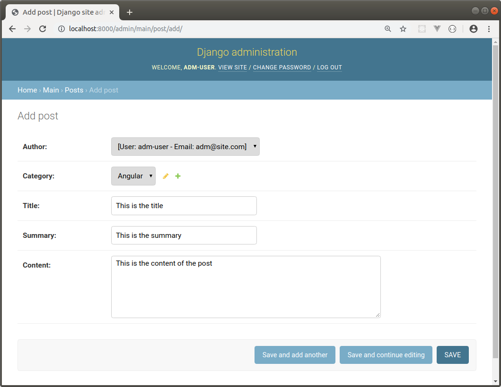
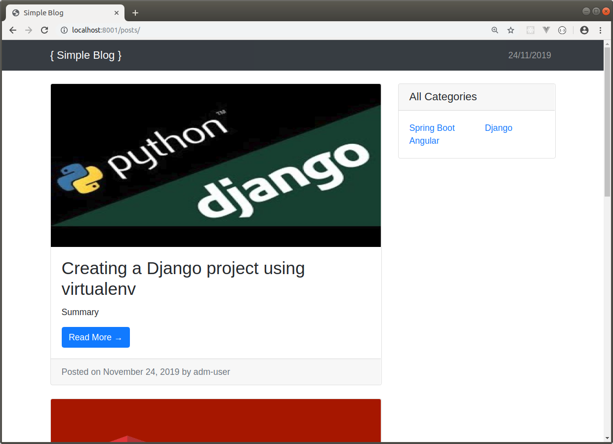

DJANGO BLOG APP
---------------------------------------------------------------------------------------------------------------------

Sencillo blog desarrollado con Django 2.2.4 y Bootstrap 4.

La aplicación se conecta a una base de datos PostgreSQL utilizando las librerias psycopg2 y dj_database_url.

---------------------------------------------------------------------------------------------------------------------

Se definen 3 models (Technology, Category y Post):


```

class Technology(models.Model):
    name = models.CharField(max_length=150)

    class Meta:
        ordering = ["name"]
    
    def __str__(self):
        return self.name


class Category(models.Model):
    technology = models.ForeignKey(Technology, on_delete=models.CASCADE)
    name = models.CharField(max_length=150)
    image = models.ImageField()

    class Meta:
        ordering = ["name"]
    
    def __str__(self):
        return self.name


class Post(models.Model):
    author = models.ForeignKey(settings.AUTH_USER_MODEL, on_delete=models.CASCADE)
    category = models.ForeignKey(Category, on_delete=models.CASCADE)
    title = models.CharField(max_length=150)
    summary = models.CharField(max_length=250)
    content = models.TextField()
    publication_date = models.DateTimeField(auto_now=False, auto_now_add=True)
    last_modification_date = models.DateTimeField(auto_now=True, auto_now_add=False)

    class Meta:
        ordering = ["-last_modification_date", "-publication_date"]
    
    def __str__(self):
        return self.title

```

---------------------------------------------------------------------------------------------------------------------

Se configuran models para ser utilizados desde la aplicación admin que provee Django,
modificando archivo admin.py:

```

admin.site.register(Technology, TechnologyModelAdmin)
admin.site.register(Category, CategoryModelAdmin)
admin.site.register(Post, PostModelAdmin)

```

---------------------------------------------------------------------------------------------------------------------

**Creación de un Post desde la aplicación admin:**



---------------------------------------------------------------------------------------------------------------------

**Despliegue de posts en página principal:**




---------------------------------------------------------------------------------------------------------------------